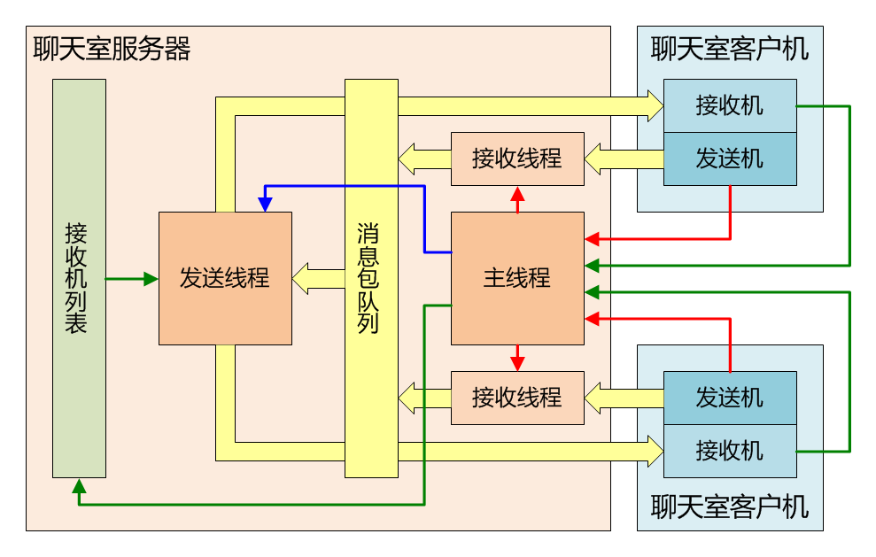

####################################
综合练习：局域网聊天室
####################################

.. literalinclude:: ./code/inc/list.h
    :language: c
    :encoding: utf-8

.. literalinclude:: ./code/inc/chatroom.h
    :language: c
    :encoding: utf-8

.. literalinclude:: ./code/src/chatroom.c
    :language: c
    :encoding: utf-8

.. literalinclude:: ./code/src/sender.c
    :language: c
    :encoding: utf-8

.. literalinclude:: ./code/src/receiver.c
    :language: c
    :encoding: utf-8

.. literalinclude:: ./code/src/makefile
    :language: makefile
    :encoding: utf-8

