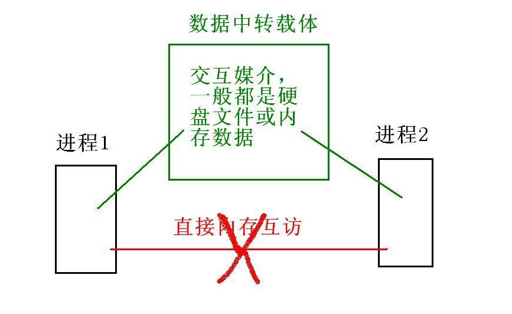

####################
进程通信   
####################

************
回顾：
************

:: 

   进程的退出方式 - 主函数执行完毕，遇到return语句
   执行了 exit() 或 _Exit() 函数
   用信号强行退出进程
   wait()和waitpid()函数 - 让父进程等待子进程结束，区别在于wait()等待任意一个子进程的结束；waitpid()可以选择等待的子进程，也可以选择不等待，直接返回。
   vfork()+execl() 方式创建进程，子进程不会复制父进程的任何资源，而是直接使用父进程的资源，导致父进程阻塞，直到调用execl()函数为止。换而言之：execl()会让父子进程并行。

   信号 - Unix系统的软件中断的方式。自定义信号处理的代码结构：

   #include <signal.h>      //信号专用的头文件
   void fa(int signo){ .... }  //信号处理函数
   int main(){
      ...;
      signal(SIGXXX,fa); //设置信号处理方式
      ...;
   }

----------

::

    今天：
       信号 - 父子进程的信号处理方式继承性、信号发送函数、
              信号集和信号屏蔽、信号的相关函数(sleep()/usleep())、计时器
       IPC  - 进程间通信(两个或多个进程间的数据交互)

::

    父子进程之间的信号处理方式：
        fork()创建的子进程对于信号的处理方式 完全继承 父进程的信号处理方式(与父进程的信号处理方式一样)。
        vfork()+execl()创建的子进程，部分继承父进程的信号处理方式。父进程是默认或忽略的，子进程会继承下来；
        父进程是自定义处理函数，子进程会改为默认处理(因为子进程中没有 父进程处理函数的代码的)。

    fork()之前的代码只有父进程执行一次，fork()之后的代码 父子进程分别执行一次(执行两次)。

::

    信号的发送方式
    1 键盘发送信号(部分)
          ctrl+c  -> 信号2
          ctrl+\  -> 信号3

    2 硬件故障发送信号(部分)
          内存没有映射 -> 段错误
          硬盘上的文件映射出错 -> 总线错误

    3 kill 命令发送信号 (全部)
          kill -信号值  进程PID

    4 信号发送函数(程序员的方式)
          raise() alarm() kill() sigqueue() ...
     讲 kill()和alarm()，严格来说，alarm()不算一个信号发送函数

.. code-block:: c

      int kill(pid_t pid,int signo)
      //  函数功能： 给进程发送信号
      //  参数： pid 代表某个或某些进程，使用方式和waitpid()一样
      //                  >0  代表某个进程
      //                  -1  代表给所有 有发送权限的进程发送信号
      //                  0   代表给本组进程发送信号
      //                  <-1 代表给进程组ID是-pid的进程发送信号
      //         signo 就是发送信号的值
      //  成功返回0，失败返回 -1 。
      //  注： 可以用 0 信号 测试 是否有发送信号的权限，而不会有任何附带的问题。

      /* 
      sleep() 和 usleep() 
      功能都是休眠，区别在于 sleep() 以秒作为单位，usleep()以微秒为单位。
      sleep()的结束可能是时间到了，也可能是被 未忽略的信号打断，此时将返回休眠的剩余秒数。
      /*

::

    信号的产生和到来时间都是无法控制的。因此在执行一些关键代码时，信号有可能带来负面影响。
    解决方案：使用信号屏蔽技术。信号屏蔽 不是 阻止 信号的到来，而是 暂时忽略信号的处理，直到解除信号屏蔽后再 处理信号。

    信号屏蔽 需要使用 信号集，信号集 就是 信号的集合。不是所有信号都可以被屏蔽，比如信号 9 。
    long long int -> 64位整数 
    信号集 可以看出一个 超大的整数。类型是：sigset_t  。一个数据结构包括：逻辑结构、物理结构、运算结构。通常的运算结构包括：
    创建、销毁、增加、删除、修改、查询，其他功能。其中，修改不是必须的，先删除后增加 也可以实现修改的效果。
    信号集提供了以下功能函数：
        sigaddset()  - 增加信号
        sigdelset()  - 删除信号
        sigfillset()  - 增加所有信号
        sigemptyset() - 删除所有信号
        sigismember() - 查询某个信号是否存在
  
   在信号集中，倒数第n位代表 信号n，权重是 2的n-1次方。
  
   信号屏蔽 由 sigprocmask() 实现，解除信号屏蔽也使用这个函数。
   

.. code-block:: c

   int sigprocmask(int how,sigset_t* new,sigset_t* old)
   // 函数功能： 屏蔽信号 或者 解除信号屏蔽
   // 参数： how 是屏蔽的算法，包括三个值，实际上使用SIG_SETMASK即可。就是 直接使用 new作为新的屏蔽
   //        new 新的信号屏蔽集
   //        old 屏蔽之前的 信号屏蔽集 ，用于 解除屏蔽，如果不需要考虑解除屏蔽，old 用 NULL 即可。
   // 返回 0 代表成功，-1 代表失败。

::

  sigaction() 是 signal()的增强版，拥有更多的功能。
   计时器 - 一段时间以后开始运行某个功能，每隔一段时间再次运行
   相对于alarm()，计时器精确到 微秒。(纯了解内容)
   计时器的原理就是 一段时间后 每隔一段时间 产生一个信号，然后在信号处理时执行 相应的代码。计时器包括：真实、虚拟和实用三种，一般使用的是 真实计时器。

   计时器函数: setitimer()设置计时器 、getitimer()获取当前计时器  
   setitimer(ITIMER_REAL,&timer,0);

************************
进程间通信 - IPC 
************************

::

   常见的IPC包括：
         文件
         信号 (signal)
         管道
         共享内存
         消息队列
         信号量集(semaphore arrays)
         网络编程socket
     ........

    其中，共享内存、消息队列和信号量集 遵循相同的规范，因此统称为XSI IPC。
    IPC 的原理都是一样的，都是通过 媒介进行数据交互，这个媒介基本上是 内存或者硬盘上的文件。

    管道( pipe )
       管道的交互媒介是 一种特殊的文件，叫 管道文件。
       管道 分为 有名管道和无名管道，无名管道 只能用于 fork()创建的父子进程之间IPC，有名管道没有限制。
       命令 touch 、函数open() 等 都不能创建出管道文件，管道文件的创建 必须使用 mkfifo命令 或 mkfifo() 函数。但 读写管道文件的函数和 普通文件 一样。

       如果只对管道文件进行读操作 或者 写操作，会 卡住(阻塞)，数据无法交互。必须 同时 具备 读操作和写操作 ，数据 才能正常传输，传输完成后，文件中 不会存留 数据。
       管道是最古老的IPC方式之一，但 目前较少使用。
       mkfifo b   创建管道文件
       ls > b
       另外一个终端 ： cat b

   练习&作业：
        用管道文件实现IPC，从pipea.c 发送100个 int 到 pipeb.c。和读写普通文件的方式一样。
   

-----------

*********
example  
*********

.. literalinclude:: ./day11/alarm.c
    :language: c
    :encoding: utf-8

.. literalinclude:: ./day11/fork.c
    :language: c
    :encoding: utf-8
 
.. literalinclude:: ./day11/itimer.c
    :language: c
    :encoding: utf-8
 
.. literalinclude:: ./day11/kill.c
    :language: c
    :encoding: utf-8

.. literalinclude:: ./day11/proc.c
    :language: c
    :encoding: utf-8

.. literalinclude:: ./day11/sigprocmask.c
    :language: c
    :encoding: utf-8

.. literalinclude:: ./day11/sigset.c
    :language: c
    :encoding: utf-8

.. literalinclude:: ./day11/sleep.c
    :language: c
    :encoding: utf-8

.. literalinclude:: ./day11/vfork.c
    :language: c
    :encoding: utf-8

.. literalinclude:: ./day11/Makefile
    :language: makefile
    :encoding: utf-8

