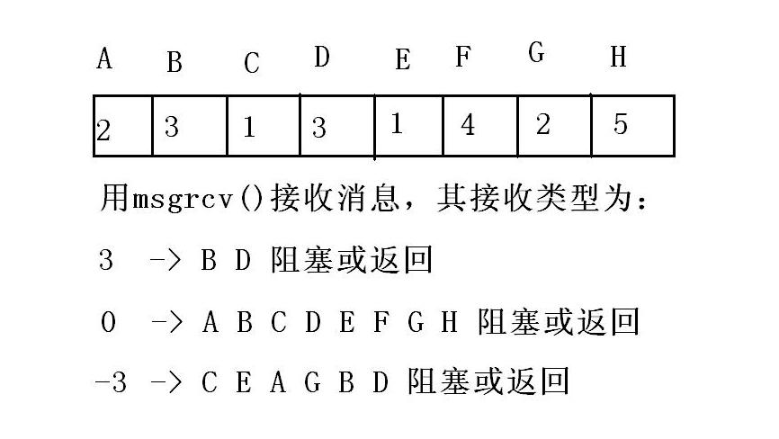

##################
进程通信 - d12  
##################

**********
回顾：
**********

:: 

   信号 -
   父子进程之间 信号的继承关系：
        fork()创建的子进程 信号处理方式 和 父进程完全一样。
        vfork()+execl()创建的子进程 信号处理方式 继承 默认和忽略，自定义处理函数的会改为默认。

   信号的发送函数 - kill()
   信号集和信号屏蔽
    sigset_t : sigaddset()/sigdelset()/sigfillset()/sigemptyset()/sigismember()
    sigprocmask()

   IPC - 管道(有名管道)
        创建管道文件必须使用 mkfifo()函数或者mkfifo命令，touch命令或者open()函数 无法创建管道文件。

今天：

************************************
XSI IPC - 共享内存、消息队列(重点)
************************************

:: 

   XSI IPC是遵循相同规范的进程间通信，包括：共享内存、消息队列、信号量集。
   共享内存的媒介就是一块系统管理的物理内存，允许多个进程挂接(映射)，实现进程间通信，使用完毕后脱接(解除映射)。共享内存是最快的IPC方式。
   消息队列的媒介就是 系统管理的 内存中的一个队列，进程可以把数据放入队列，或者从队列中取出数据。消息队列是一个比较快的IPC方式。
   XSI IPC都有固定的使用套路，记住步骤即可。
   XSI IPC的共同规范：
    1 设计套路是一样的，首先都需要一个外部的key，然后用外部的key创建/获取内部ID，这个内部的ID 就可以代表 内核管理的IPC 结构(共享内存、消息队列、信号量集的统称)。
    2 外部的key有三种获取方式：
     2.1 宏 IPC_PRIVATE 做key，但这种方式基本不被使用。因为IPC_PRIVATE 禁止其他进程使用。(知道即可，用不上)
     2.2 写一个通用的头文件，把所有的key定义在这个头文件。因为这个key 其实就是一个整数，类型是 key_t。(集中管理)
     2.3 使用 ftok()函数 生成 外部的key。(单独生成)
    3 用key创建/获取内部ID时，函数名都是： xxxget()，比如：
     共享内存 shmget()
     消息队列 msgget()
    4 使用 xxxget()创建IPC结构时，都有一个flag参数，其值都是：
     权限|宏，比如： 0666|IPC_CREAT
    5 都有一个xxxctl()函数，提供查询、修改和删除功能。
     比如： shmctl()    msgctl()，函数中利用宏参数实现功能。
      IPC_STAT  :  查询IPC结构
      IPC_SET    :  修改IPC结构
      IPC_RMID ： 删除IPC结构(按ID)

共享内存的使用步骤：
=======================
   
* 1 使用ftok()或者从头文件中 获得 key 。
* 2 使用key 创建/获取共享内存，函数是 shmget()。
* 3 使用shmat()函数 挂接(映射) 共享内存。
* 4 使用共享内存中的数据。
* 5 使用shmdt()函数 脱接(解除映射) 共享内存。
* 6 如果确保不再使用，可以用 shmctl(IPC_RMID) 删除。

系统现有的XSI IPC结构 可以用命令操作：

.. code-block:: sh

     # ipcs 查看IPC结构
     ipcs -a  #查看所有IPC结构
     ipcs -m  #查看共享内存
     ipcs -q  #查看消息队列
     ipcs -s  #查看信号量集

     #ipcrm 删除IPC结构(按ID删除)
     ipcrm -m 内部ID  # 删除共享内存
     ipcrm -q 内部ID  # 删除消息队列
     ipcrm -s 内部ID  # 删除信号量集
     
     # 注： 共享内存的删除必须保证没有进程挂接，否则只做删除标志而不真正删除，挂接数为0 时 在删除(延后删除)。

::

    共享内存的优缺点：
    优点是 最快的IPC，效率最高。缺点是 如果多个进程写，会产生互相覆盖的问题，数据 没法保证。
    消息队列能很好的解决这个问题。
    消息队列 其实就是系统 管理了一个队列，每个进程都可以获取这个队列，然后把数据封入消息(结构体)中，再把消息放入队列中。 
    消息队列的使用步骤：
        1 使用 ftok() 或 从 头文件中 获取 外部的key。
        2 使用 msgget() 创建/获取 消息队列。
        3 使用msgsnd()/ msgrcv() 发送/接收 消息到队列中。
        4 如果确保消息队列不再使用，使用msgctl(IPC_RMID)删除。

     msgsnd()和msgrcv() 可以发送或者接收消息。
     消息分为 有类型消息和无类型消息，无类型消息可以是任意的类型，数据本身就是消息。有类型消息必须是一个结构，格式如下：
        struct 消息名{ //消息名可以随便起，是合法标识符
           long mtype; //第一个必须是消息类型，其值必须大于0
           char buf[]; //数据区，类型一般是数组 或者 结构体，名字随意
        };
           
    int msgsnd(int msgid,void* buf,size_t size,int flag)
    函数功能：向消息队列中 放入消息。
    参数：msgid 就是消息队列的内部ID；buf就是消息，可以是有类型的，也可以是无类型的；size 是数据的大小，对于无类型消息，就是数据的大小，而对于有类型消息，不是消息结构体的大小，而是数据区的大小(不算数据类型)；flag 为0 就是满了会阻塞，为IPC_NOWAIT 就是满了直接返回-1 不阻塞。
    返回值： 0 代表成功，-1 代表失败。

    int msgrcv(int msgid,void* buf,size_t size,long mtype,int flag)
    函数功能：从消息队列中 按类型 取出消息
    参数：msgid 就是消息队列的内部ID；buf就是用于接收消息的首地址，可以是有类型消息，也可以是无类型消息；size 是数据的大小，对于无类型消息，就是数据的大小，而对于有类型消息，不是消息结构体的大小，而是数据区的大小(不算数据类型)；flag和上面一样；mtype代表接收消息的类型，其值可以有三种：
        > 0   就取类型为mtype的消息。
        ==0  取任意类型的消息(什么类型都可以，先入先出)
        < 0   取类型小于等于 mtype绝对值的消息，从小到大取。
    返回：失败返回-1 ，成功返回 实际接收到的字节数。  

::

    商业公司做项目的流程：
       1 需求分析 - 弄清用户要做什么软件，功能有哪些。
       2 系统分析和系统设计 - 搭建软件的结构和模块，具体如何实现。
       3 编码 - 程序员编程把设计实现。
       4 测试 - 程序员进行单元测试，测试工程师进行其他测试。
       5 安装和维护 - 把软件安装配置到用户服务器上，并且做日常维护和调整，包括功能增加和调整。

    综合案例：
       涉及的知识点：文件读写、文件操作、进程管理、信号处理、消息队列。
       
    模拟银行ATM机(了解一下银行业务)
        ATM 提供6个功能：
        开户、销户、存钱、取钱、查询余额、转账
       明天做一个开户就可以，基础好的全做。
       开户的流程：输入账户信息
        (卡号ID,名字name,密码passwd,金额money)，然后把这些信息写入文件中，如果没有出错，则开户成功，否则开户失败。

      项目设计：
       至少要写两个程序，客户端和服务器端。先启动服务器端，服务器端先创建2个消息队列，分别是服务器发给客户端 和 客户端发给服务器的，然后服务器就 等待接收 来自客户端的消息。
      接下来客户端启动，发送消息给服务器(通过消息队列)。消息采用有类型消息，共8种类型：开户、销户、存钱、取钱、查询、转账、操作成功、操作失败。消息的数据 就写一个 账户结构体：
      struct Account{
             int id;
             char name[40];
             char passwd[40];
             double money;
      };

     服务器收到消息后进行处理，把处理结果通过消息队列返回给客户端

      开户时客户端输入name、passwd(两次)、money，然后封入消息中传递到服务器，服务器负责生成 无重复的id，把这个结构写入文件中。根据写入的结果返回给客户端。
      注意问题：
        1 服务器读取来自客户端的消息时，应该是死循环，用ctrl+c(信号)退出。退出时应该删除消息队列。
        2 如何生成无重复的ID？ID要从文件中读取，自增后做新的ID，然后再把新ID 写回到文件中。
        3 把账户结构体写入文件中，每个账户生成一个文件。
       

**********
examble   
**********

.. literalinclude:: ./day12/pipea.c
    :language: c
    :encoding: utf-8

.. literalinclude:: ./day12/pipeb.c 
    :language: c
    :encoding: utf-8

------------

.. literalinclude:: ./day12/shma.c
    :language: c
    :encoding: utf-8

.. literalinclude:: ./day12/shmb.c
    :language: c
    :encoding: utf-8

.. literalinclude:: ./day12/shmctl.c
    :language: c
    :encoding: utf-8

--------------

.. literalinclude:: ./day12/msga.c
    :language: c
    :encoding: utf-8

.. literalinclude:: ./day12/msgb.c
    :language: c
    :encoding: utf-8

.. literalinclude:: ./day12/msgtypea.c
    :language: c
    :encoding: utf-8

.. literalinclude:: ./day12/msgtypeb.c
    :language: c
    :encoding: utf-8

-------------

.. literalinclude:: ./day12/Makefile
    :language:  makefile
    :encoding: utf-8

