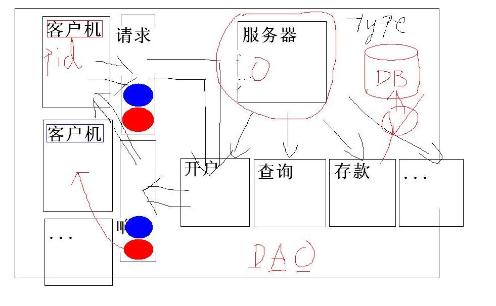

##############################
进程通信 - d13
##############################

* 1.简单进程间通信：命令行参数、环境变量、信号、文件
* 2.传统进程间通信：管道(pipe/mkfifo)
* 3.现代进程间通信：共享内存、消息队列、信号量
* 4.网络进程间通信：套接字

************************
练习：本地银行(ATM)
************************

.. literalinclude:: ./bank/inc/bank.h
    :language: c
    :encoding: utf-8

.. literalinclude:: ./bank/inc/dao.h
    :language: c
    :encoding: utf-8

.. literalinclude:: ./bank/src/dao.c
    :language: c
    :encoding: utf-8

.. literalinclude:: ./bank/src/client.c
    :language: c
    :encoding: utf-8

.. literalinclude:: ./bank/src/open.c
    :language: c
    :encoding: utf-8

.. literalinclude:: ./bank/src/query.c
    :language: c
    :encoding: utf-8

.. literalinclude:: ./bank/src/server.c
    :language: c
    :encoding: utf-8

---------------

****************
一、信号量
****************

1.基本特点
============

1)资源计数器，用于限制多个进程对有限共享资源的访问。

2)多个进程获取有限共享资源的操作模式

:: 

    A.测试控制该资源的信号量；
    B.若信号量大于0，则进程可以使用该资源，
      为了表示此进程已获得该资源，需将信号量减1；
    C.若信号量等于0，则进程休眠等待该资源，
      直到信号量大于0，进程被唤醒，执行步骤A；
    D.当某进程不再使用该资源时，信号量增1，
      正在休眠中等待该资源的进程将被唤醒。

2.常用函数
================

.. code-block:: c

    #include <sys/sem.h>

    /* 1)创建/获取信号量(集合) */
    int semget (key_t key, int nsems, int semflg);

    // A.该函数 以key参数为键值创建一个信号量集合
    //          (nsems参数表示该集合中信号量的个数)，
    //           或获取已有信号量集合(nsems取0)。
    // B.semflg取值
    //   0 - 获取，不存在即失败。
    //   IPC_CREAT - 创建，不存在即创建，
    //              已存在即获取，除非...
    //   IPC_EXCL - 排斥，已存在即失败。
    // C.成功返回信号量集合的标识，失败返回-1。

    /* 2)操作信号量 */
    int semop (int semid, struct sembuf* sops, unsigned int nsops);
    struct sembuf {
        unsigned short sem_num; // 信号量下标
        short          sem_op;  // 操作数
        short          sem_flg; // 操作标记
    };

    // A.该函数对semid参数所标识的信号量集合中，
    //   由sops参数所指向的包含nsops个元素的，
    //   结构体数组中的每个元素，依次执行如下操作：
    // 
    //   a)若sem_op大于0，
    //     则将sem_op加到信号量集合中第sem_num个信号量的计数值上，
    //     以表示对资源的释放。
    //   b)若sem_op小于0，
    //     则从信号量集合中第sem_num个信号量的计数值中减去其绝对值，
    //     以表示对资源的获取。
    //   c)若信号量集合中第sem_num个信号量的计数值不够减(信号量的计数值不能为负)，
    //     此函数会阻塞，直到够减为止，以表示对资源的等待。
    //   d)若sem_flg包含IPC_NOWAIT位，即使被操作的信号量不够减，也不会阻塞，
    //     而是返回-1，同时将errno置为EAGAIN。
    //     以允许进程在等待资源的同时，完成其它任务。

    // 5本三国演义，4本水浒传，3本西游记
    int semid = semget (key, 3, IPC_CREAT | IPC_EXEL);
    // 将所创建信号量集合中的3个元素依次初始化为：5、4和3
    // ...
    // 某人欲借2本三国演义和1本西游记
    //     struct sembuf sops[2];
    //     sops[0].sem_num = 0;
    //     sops[0].sem_op = -2;
    //     sops[1].sem_num = 2;
    //     sops[1].sem_op = -1;
    //     semop (semid, sops, 2);
    // 还1本三国演义同时借2本水浒传
    //    struct sembuf sops[2];
    //    sops[0].sem_num = 0;
    //    sops[0].sem_op = 1;
    //    sops[1].sem_num = 1;
    //    sops[1].sem_op = -2;
    //    semop (semid, sops, 2);

    /* 3)销毁/控制信号量 */
    int semctl (int semid, int semnum, int cmd);
    int semctl (int semid, int semnum, int cmd, union semun arg);
    union semun {
            int val;               // cmd取SETVAL
            struct semid_ds* buf;  // cmd取IPC_STAT/IPC_SET
            unsigned short* array; // cmd取GETALL/SETALL
            struct seminfo* __buf; // cmd取IPC_INFO
    };

    // A.cmd取值
    //    IPC_STAT - 获取信号量集合的属性，通过arg.buf输出
    //    union semun arg;
    //    struct semid_ds buf;
    //    arg.buf = &buf;

    semctl (semid, 0, IPC_STAT, arg);
    struct semid_ds {
      struct ipc_perm sem_perm;  // 权限信息
      time_t          sem_otime; // 最后操作时间
      time_t          sem_ctime; // 最后改变时间
      unsigned shrot  sem_nsems; // 信号量个数
    };
    struct ipc_perm {
      key_t  __key; // 键值
      uid_t  uid;   // 用户ID
      gid_t  gid;   // 组ID
      uid_t  cuid;  // 创建者用户ID
      gid_t  cgid;  // 创建者组ID
      unsigned short mode; // 权限字
      unsigned short __seq;  // 序列号
    };
    // IPC_SET - 设置信号量集合的属性，通过arg.buf输入。
    // 只有以下三个属性可以设置：
    //    semid_ds::sem_perm.uid;    // 用户ID
    //    semid_ds::sem_perm.gid;    // 组ID
    //    semid_ds::sem_perm.mode;   // 权限字
    // IPC_RMID - 删除信号量集合。
    semctl (semid, 0, IPC_RMID);
    //     此时所有阻塞在该信号量集合上的semop函数都会立即返回失败，
    //     errno为EIDRM。
    //     GETALL - 获取信号量集合中所有信号量计数值。

    short array[3];
    union semun arg;
    arg.array = array;
    semctl (semid, 0, GETALL, arg);
    //    SETALL - 设置信号量集合中所有信号量计数值。

    short array[3] = {5, 4, 3};
    union semun arg;
    arg.array = array;
    semctl (semid, 0, SETALL, arg);
    //      GETVAL - 获取一个信号量的计数值。
    int shuihuzhuan = semctl (semid, 1, GETVAL);
    //      SETVAL - 设置一个信号量的计数值。

    union semun arg;
    arg.val = 6;
    semctl (semid, 1, SETVAL, arg);
    // 注意：只有针对信号量集合中某个具体信号量的操作，
    //       才会使用semnum参数。凡是针对信号量集合整体的操作，
    //       该参数会被忽略。
    // 成功返回值因cmd而异，失败返回-1。

